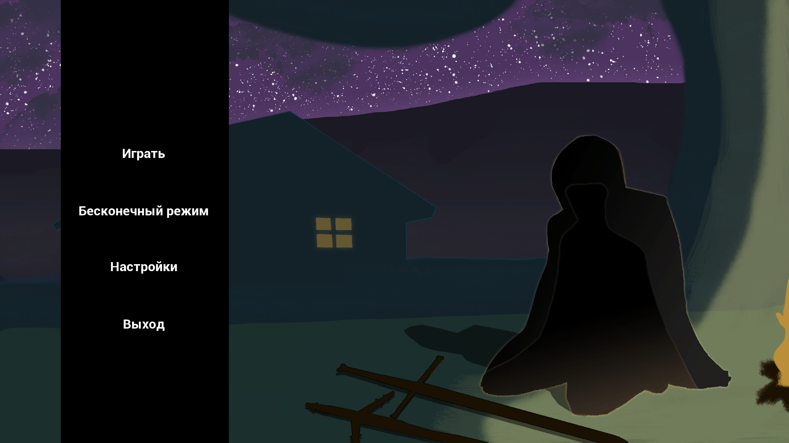
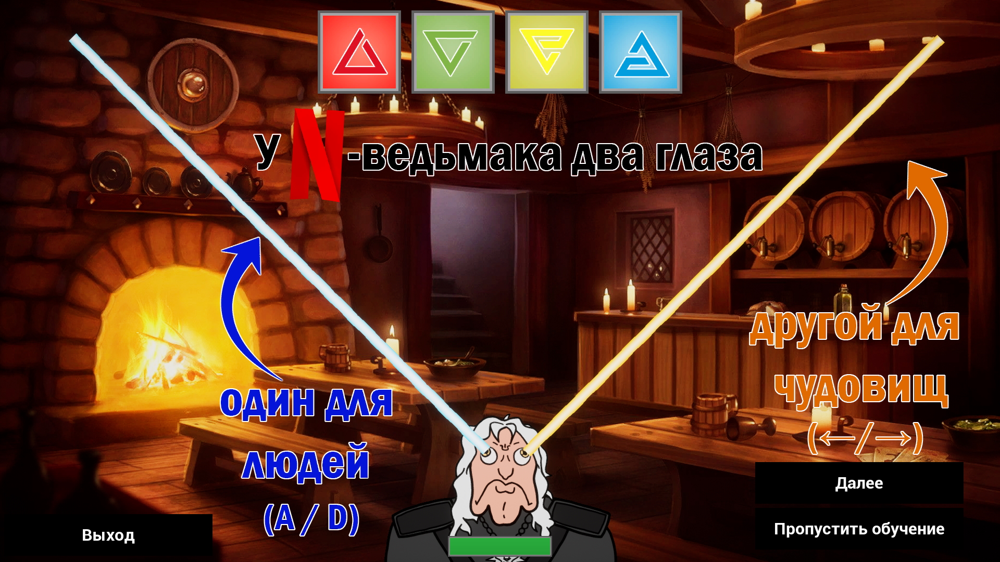
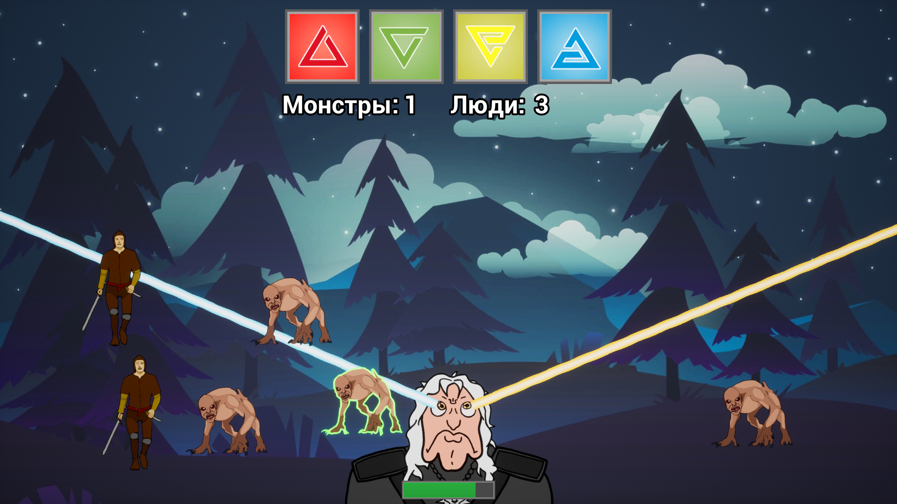

# ProjectGervant
🎮 A game which is inspired by joke on NetCancel changesflix witcher having a strabismus

👀 A witcher has two eyes: one for the monsters, another... for humans. During the game you will have to fight human and monster enemies who can only be dealt with according eye beam. Player also can use witcher signs that give him additional advantage over enemies.

Here is a [link](https://drive.google.com/drive/folders/11d3mM7W6jGu5pFzA8_3T-IGqTYmTnPwn?usp=sharing) to last version of the game (need to download the folder and run .exe file).  

